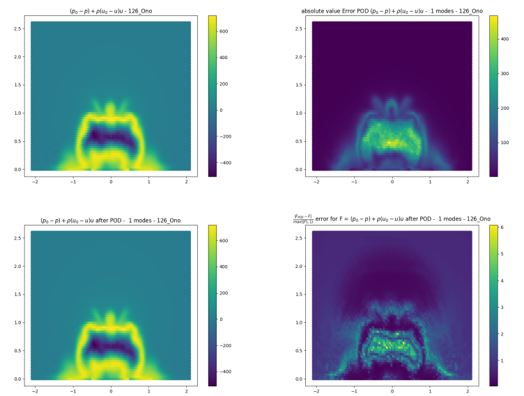

# Methods for reducing models for the prediction of aerodynamic drag
This internship project at car company tackles the prediction of car aerodynamic drag within the goal of establishing a suited reduction model technique.
Some techniques involved are linear algebra dimension reduction, variational auto-encoders, and optimal transports.

